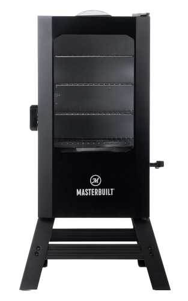
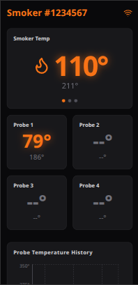

# Smart Smoker Controller System

This project replaces the standard control board in an electric smoker, adding Wi-Fi, PID heat control, four built-in meat probes, a companion mobile app, and more. You can remotely monitor and control your cook from anywhere without being tied down to the smoker. The custom PID algorithm maintains an almost perfect internal temperature with minimal fluctuations. A variety of push notifications are supported, eliminating the need to constantly check on your cook throughout the day and night.

The primary goal of this project is to give you your weekend back. Whether you're spending the day snowboarding, hitting trails, off-roading, or just hanging out with friends, you shouldn't have to constantly babysit the smoker. The controller continuously monitors the smoker and meat temperature, sending real-time notifications to your phone when probes hit their target temperatures.

This specific board was designed as a drop-in replacement for Masterbuilt refrigerator-style smokers, but the system can be adapted to work with almost any electric smoker.



## Overview

This repository is split into four major components, each with its own detailed `README.md` file:

### 1. Mobile App (./www/README.md)
A Progressive Web App (PWA) that can be installed on your phone to run exactly like a native app, complete with real-time push notifications.



### 2. Backend (./server/README.md)
The central nervous system of the project. It acts as the bridge between the physical smoker and the mobile application. The backend handles the complex algorithms for stall detection and logs high-resolution temperature history. The system is highly fault-tolerant: if the backend drops offline, the firmware will continues executing the active cook locally. If the backend loses connection to the smoker, an alert is sent immediately to your phone.

### 3. Firmware (./firmware/README.md)
The embedded code running on the physical microcontroller (ESP32) that directly interfaces with the smoker's hardware.

### 4. Hardware & PCBs (./hardware/README.md)
This directory contains the custom board designs. Currently, there are two boards designed to support Masterbuilt smokers: the main controller PCB and the power module. The custom power module replaces the stock mechanical relay with a Solid State Relay (SSR) to easily tolerate the rapid on/off switching required by the PID heat control.

## 📂 Repository Structure

```text
├── /server             # Node.js backend
├── /firmware           # Microcontroller code (ESP32/Arduino)
├── /www                # React / Vite / Tailwind PWA
├── /hardware           # Schematics and Gerber files
└── README.md           # Project overview (You are here)
